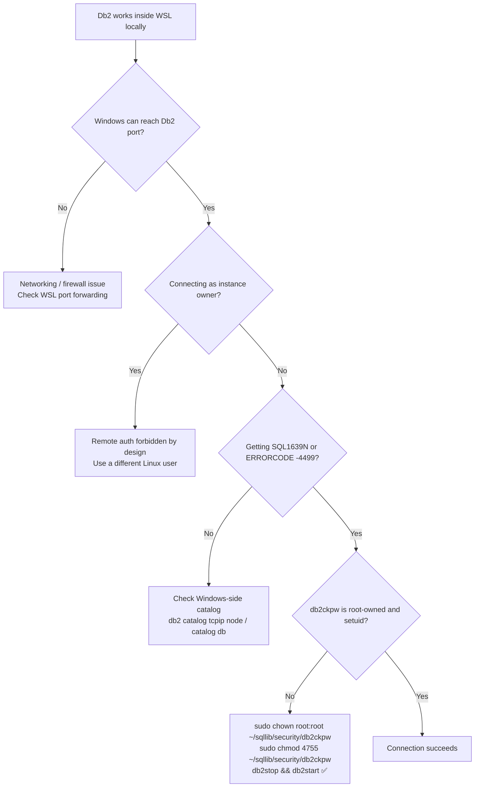

# IBM Db2 on WSL: The One Linux Permission That Silently Breaks Remote Authentication

*Db2 runs flawlessly inside WSL. Every remote client fails. Here's why — and the two commands that fix it.*

---

I spent longer than I'd like to admit debugging this. IBM Db2 12.1, running inside WSL2 on Ubuntu, worked perfectly from the command line. Local Python scripts connected fine. The TCP/IP listener was up. Windows could reach the port. And yet:

```
ERRORCODE=-4499
SQLSTATE=08001
```

Every remote client — Windows Db2 CLP, VS Code's IBM Db2 Developer Extension, JDBC — refused to authenticate. The errors were vague enough to send you in entirely the wrong direction.

The actual root cause? A single Linux permission bit on a binary most Db2 users have never heard of.

---

## The Environment

- IBM Db2 12.1 LUW on Ubuntu 22.04 under WSL2
- Db2 instance running, TCP/IP enabled, listener confirmed active
- Default WSL user (matching my Windows username) — *not* the instance owner
- Clients: Windows Db2 CLP, VS Code Db2 Developer Extension

---

## What Didn't Matter (And Will Waste Your Time)

The failure pattern points you toward the wrong things. Before finding the actual cause, I ruled out — correctly — all of the following:

- **`DB2COMM=TCPIP`** — already set
- **`SVCENAME`** — port was listening; `ss -lntp | grep 25000` confirmed it
- **`AUTHENTICATION=SERVER`** — correct for Db2 12.1
- **TRUST settings** — `TRUST_ALLCLNTS=YES` is enforced when `AUTHENTICATION=SERVER`; you can't usefully change this
- **Windows firewall / WSL networking** — `Test-NetConnection` succeeded
- **VS Code configuration** — not the issue
- **Creating a separate `db2user` OS account** — unnecessary (more on this below)

If Windows can reach the port and Db2 is working locally, none of those are your problem.

---

## One Rule You Can't Break: Don't Use the Instance Owner Remotely

Db2 explicitly forbids remote TCP/IP authentication for the instance owner. This is by design, not a misconfiguration. Local CLI access in WSL works fine for the instance owner; remote connections do not — ever.

What this means in practice: any other valid Linux user with a real password can authenticate remotely. Your default WSL user is fine, provided it isn't the instance owner and has a password set in `/etc/shadow`. There's no need to create a dedicated `db2user` OS account unless you specifically want one.

---

## The Actual Root Cause: `db2ckpw`

On Linux, Db2 doesn't validate remote passwords itself. It delegates that work to a privileged helper binary:

```
~/sqllib/security/db2ckpw
```

When a remote client sends credentials, Db2 forks this binary to perform PAM authentication and check against `/etc/shadow`. This is why remote and local auth are handled differently — local CLI commands run in your session context; remote connections have no such privilege, so they need the helper.

For `db2ckpw` to do its job, Linux requires it to be:

- **Owned by `root`**
- **Setuid-root** (the `s` bit in `-rwsr-xr-x`)
- **Executable**
- **On a native Linux filesystem** (not `/mnt/c` — the NTFS mount drops setuid entirely)

The setuid bit is the critical part. When Linux executes a setuid-root binary, the kernel temporarily elevates the process to run as root, regardless of who invoked it. That's what gives `db2ckpw` the access it needs to read `/etc/shadow`. Without it, the binary runs as the Db2 instance user — which doesn't have that access — and authentication fails.

When the bit is missing or ownership is wrong, this is what you get:

```
SQL1639N The database server was unable to perform authentication because
security-related database manager files on the server do not have the
required operating system permissions.
SQLSTATE=08001
```

`SQL1639N` is actually a useful error once you know what it's pointing at. The cryptic `ERRORCODE=-4499` you'll see from JDBC is the same underlying failure, just reported at the driver level.

---

## Why WSL Is Especially Prone to This

WSL fully supports Linux setuid semantics — but it doesn't protect them from you. Any of the following can silently strip the bit:

- Installing Db2 without root (fairly common in WSL environments)
- Running `chmod -R` on your home directory
- Restoring a home directory from a backup or tar archive
- Migrating between WSL distributions
- Any file copy operation that doesn't explicitly preserve special bits

What makes this particularly hard to catch: local connections keep working regardless. The setuid bit is only exercised during remote authentication. You can run Db2 locally for weeks without noticing it's broken.

---

## The Fix

Inside WSL:

```bash
sudo chown root:root ~/sqllib/security/db2ckpw
sudo chmod 4755 ~/sqllib/security/db2ckpw
```

Verify it took:

```bash
ls -l ~/sqllib/security/db2ckpw
```

You should see:

```
-rwsr-xr-x 1 root root ... db2ckpw
```

The `s` where `x` would normally be in the owner field is the setuid bit. That's what you're looking for.

Restart Db2:

```bash
db2stop
db2start
```

Then from Windows:

```bat
db2 connect to <DBNAME> user <your_wsl_username> using <password>
```

---

## Diagnostic Flow

If you're not sure where you are in the debugging process, this covers the likely paths:



---

## Quick Checklist

Before touching anything else, verify these five things:

| Check | Command / verification |
|---|---|
| TCP/IP listener active | `ss -lntp \| grep 25000` |
| Not connecting as instance owner | `db2 get instance` — compare with your login |
| Login user has a Linux password | `sudo passwd <username>` |
| Database catalogued on Windows side | `db2 list node directory` |
| `db2ckpw` is setuid-root | `ls -l ~/sqllib/security/db2ckpw` — look for `-rwsr-xr-x` |

If the fifth row isn't right, nothing else matters.

---

## Takeaway

WSL is a genuinely excellent environment for running IBM Db2. It behaves like Linux because it is Linux. The flip side is that it inherits Linux's security model — including the expectation that certain privileged binaries are protected correctly.

`db2ckpw` is the one file that makes remote authentication work. If its permissions are wrong, Db2 will give you nothing useful beyond `SQL1639N` — and that error doesn't exactly shout "check your setuid bits."

Now you know where to look first.
